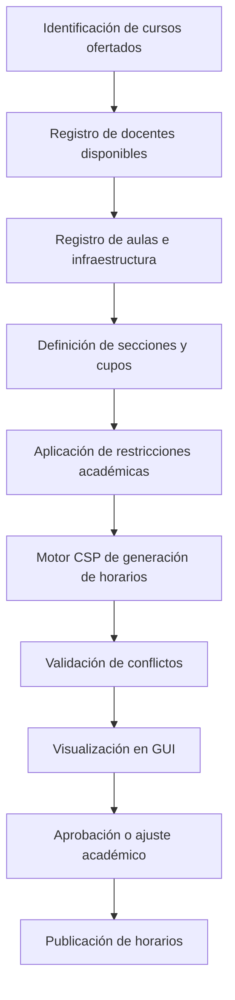
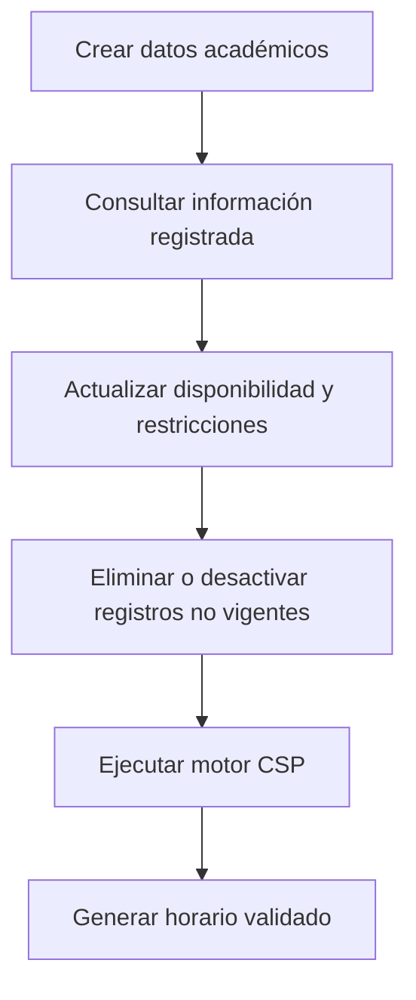
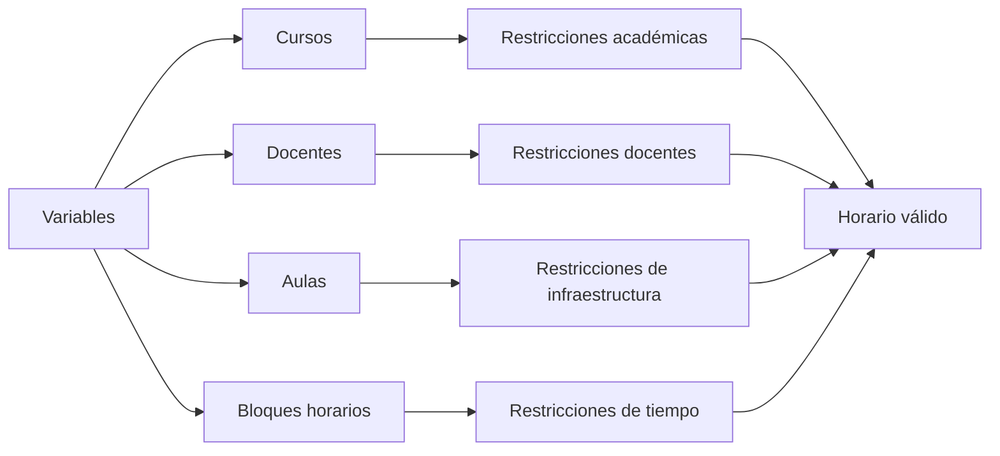

# ✅ Análisis y validación del problema - SmartSched-UC

## 1. Propósito del documento

Este documento tiene como propósito consolidar el análisis y la validación del problema del sistema **SmartSched-UC**, orientado a la generación óptima de horarios académicos universitarios mediante un enfoque basado en **Constraint Satisfaction Problem (CSP)**, optimización combinatoria, desarrollo web con stack MERN, principios de Spec-Driven Development, prácticas TDD y control documental mediante GitHub.

El objetivo principal no es únicamente construir una aplicación funcional, sino demostrar que el problema fue comprendido, validado y modelado correctamente desde una perspectiva de ingeniería de software. Para ello, se analizan los actores involucrados, los requerimientos funcionales y no funcionales, las restricciones críticas, las dependencias del sistema, los indicadores clave de éxito, la finalidad de la GUI, el proceso CRUD y la relación entre la optimización y la planificación académica institucional.

---

## 2. Contexto del problema

La planificación académica universitaria es un proceso complejo porque involucra múltiples variables que deben coordinarse de manera simultánea. En una universidad con currículo flexible, la generación de horarios no depende solamente de colocar cursos en determinados bloques, sino de considerar docentes, aulas, estudiantes, secciones, créditos, disponibilidad horaria, carga académica, carga administrativa, infraestructura, aforo y reglas institucionales.

SmartSched-UC aborda este problema como un sistema de apoyo a la planificación académica y a la matrícula, permitiendo generar horarios válidos y optimizados a partir de restricciones reales. El sistema busca reducir errores como cruces de horario, uso simultáneo de aulas, sobrecarga docente, incumplimiento de créditos, mala distribución de recursos e incompatibilidad con estudiantes que realizan prácticas preprofesionales o tienen disponibilidad limitada.

El problema es relevante porque afecta directamente a diferentes actores. Los estudiantes pueden perder cursos por cruces de horario; los docentes pueden recibir una carga mal distribuida; los coordinadores académicos pueden invertir demasiado tiempo revisando horarios manualmente; y la institución puede hacer un uso ineficiente de su infraestructura.

---

## 2.1 Fundamentación del problema desde investigación documental

La generación de horarios académicos puede relacionarse con uno de los problemas más frecuentes en proyectos de software: la mala definición y validación de requerimientos. Diversos estudios sobre proyectos tecnológicos, como los informes relacionados al análisis de éxito y fracaso de proyectos de software, han señalado que los requerimientos incompletos, ambiguos, cambiantes o poco validados con usuarios reales pueden afectar negativamente el resultado final del sistema.

En ese sentido, SmartSched-UC no debe construirse únicamente desde una perspectiva técnica o algorítmica. El sistema debe partir de una comprensión real del proceso académico, considerando reglas institucionales, restricciones operativas, necesidades de estudiantes, disponibilidad docente, uso de infraestructura y criterios administrativos.

Por ello, la validación del problema se desarrolló considerando tres fuentes principales:

| Fuente de validación                           | Descripción                                                                                                                       | Aporte al proyecto                                                    |
| ---------------------------------------------- | --------------------------------------------------------------------------------------------------------------------------------- | --------------------------------------------------------------------- |
| Revisión documental                            | Análisis de la consigna, documentación del proyecto, requerimientos y restricciones existentes                                    | Permite alinear el sistema con los objetivos académicos del curso     |
| Revisión técnica del MVP                       | Evaluación del backend, frontend, motor CSP, datos de prueba y estructura del repositorio                                         | Permite identificar mejoras necesarias en la aplicación               |
| Validación exploratoria del contexto académico | Recopilación de comentarios y criterios relacionados con estudiantes, docentes, aulas, carga académica y procesos administrativos | Permite acercar el proyecto a una problemática real y no solo teórica |

Esta fundamentación permite justificar que el sistema no debe limitarse a generar horarios visualmente correctos, sino que debe validar reglas, explicar conflictos y apoyar la toma de decisiones académicas.

---

## 2.2 Validación exploratoria con usuarios y contexto académico

Para complementar el análisis documental, se consideró una validación exploratoria del problema con usuarios relacionados al entorno académico. Esta validación permitió identificar necesidades reales que se presentan durante la planificación de horarios, la matrícula, la asignación docente y la distribución de aulas.

Los perfiles considerados fueron:

| Perfil consultado o analizado                 | Relación con el problema                                                             | Información buscada                                              |
| --------------------------------------------- | ------------------------------------------------------------------------------------ | ---------------------------------------------------------------- |
| Estudiantes universitarios                    | Son afectados por cruces de horarios, límites de créditos y disponibilidad de cursos | Identificar problemas frecuentes durante la matrícula            |
| Estudiantes con prácticas preprofesionales    | Necesitan compatibilizar cursos con horarios de prácticas o trabajo                  | Identificar necesidad de horarios flexibles e inclusivos         |
| Docentes con carga académica                  | Deben cumplir horas lectivas asignadas según su tipo de contrato                     | Validar restricciones de carga horaria y disponibilidad          |
| Docentes con carga académica y administrativa | Además de dictar clases, cumplen funciones de coordinación, gestión o administración | Evitar sobreasignación y considerar tiempos bloqueados           |
| Docentes contratados o de medio tiempo        | Tienen disponibilidad y carga menor que un docente a tiempo completo                 | Diferenciar reglas según tipo de contratación                    |
| Coordinadores académicos                      | Organizan secciones, cursos, docentes y aulas                                        | Identificar reglas burocráticas y operativas                     |
| Área administrativa o académica               | Gestiona recursos institucionales y cumplimiento normativo                           | Validar restricciones de infraestructura y planificación         |
| Equipo de desarrollo                          | Analiza, modela e implementa el sistema                                              | Convertir necesidades en requerimientos, restricciones y pruebas |

---

## 2.3 Comentarios representativos del contexto académico

Durante la socialización y análisis del problema se identificaron comentarios representativos que ayudan a comprender la necesidad del sistema:

| Comentario identificado                                                                               | Interpretación técnica                                                                         | Requerimiento o restricción asociada     |
| ----------------------------------------------------------------------------------------------------- | ---------------------------------------------------------------------------------------------- | ---------------------------------------- |
| "A veces los cursos que necesito llevar se cruzan y no puedo completar mis créditos."                 | El sistema debe evitar solapamientos entre cursos seleccionados                                | Validación de cruces de horario          |
| "Los estudiantes que hacen prácticas preprofesionales necesitan horarios más ordenados."              | El sistema debe permitir priorizar horarios compactos o compatibles con disponibilidad externa | Optimización de horarios inclusivos      |
| "Un docente no puede dictar dos clases al mismo tiempo."                                              | Restricción dura de disponibilidad docente                                                     | Validación de conflicto docente          |
| "Algunos docentes tienen carga administrativa y no todo su tiempo está disponible para clases."       | No todos los docentes tienen la misma disponibilidad real                                      | Bloqueo de horarios administrativos      |
| "Los docentes a tiempo completo pueden tener una carga distinta a los contratados o de medio tiempo." | Se deben manejar reglas diferentes según tipo de contrato                                      | Gestión de carga académica diferenciada  |
| "El docente debe cumplir una carga referencial de 36 horas según su rol y dedicación."                | La carga docente debe controlarse para evitar subcarga o sobrecarga                            | Validación de horas asignadas            |
| "No basta con que exista un aula libre; también debe tener capacidad suficiente."                     | El aula debe evaluarse por aforo, tipo y porcentaje de uso                                     | Validación de infraestructura            |
| "Si el sistema muestra error, debería explicar por qué no se puede generar el horario."               | La GUI debe ser transparente y mostrar conflictos                                              | Explicación de restricciones incumplidas |
| "A veces el proceso no depende solo de lo técnico, también hay reglas administrativas."               | El sistema debe considerar flujos de aprobación y reglas burocráticas                          | Validación operativa del proceso         |

Estos comentarios permiten concluir que SmartSched-UC debe responder a un problema real y multidimensional. La generación de horarios no solo depende del algoritmo, sino también de reglas académicas, disponibilidad humana, infraestructura y procesos administrativos.

---

## 3. Proceso mayor donde se aplica la optimización

El proceso mayor donde se aplica la optimización es la **planificación académica institucional y validación operativa de matrícula**.

Este proceso comprende la organización de cursos, secciones, docentes, aulas, horarios y disponibilidad de estudiantes antes del inicio de un periodo académico. La optimización permite tomar mejores decisiones al momento de asignar recursos y validar si una propuesta de horario es viable.

El proceso puede representarse de la siguiente manera:



La optimización contribuye al proceso académico porque permite:

* reducir cruces de horario;
* evitar asignaciones docentes imposibles;
* mejorar el uso de aulas;
* respetar límites de créditos;
* considerar disponibilidad de docentes;
* considerar carga académica y administrativa;
* mejorar la experiencia de matrícula;
* apoyar decisiones de coordinadores académicos;
* hacer más inclusiva la planificación para estudiantes que trabajan o realizan prácticas.

---

## 4. Actores involucrados y necesidades identificadas

El análisis permitió identificar que el sistema involucra varios actores con necesidades diferentes, pero relacionadas entre sí.

| Actor                                     | Necesidad principal                                                                               | Problema identificado                                                                  | Cómo responde SmartSched-UC                                   |
| ----------------------------------------- | ------------------------------------------------------------------------------------------------- | -------------------------------------------------------------------------------------- | ------------------------------------------------------------- |
| Estudiante regular                        | Obtener un horario válido y matriculable                                                          | Cruces de horario, exceso o falta de créditos, poca claridad en combinaciones posibles | Genera combinaciones válidas y muestra conflictos             |
| Estudiante con prácticas preprofesionales | Compatibilizar clases con horarios de prácticas o trabajo                                         | Horarios dispersos, cruces con prácticas o turnos no convenientes                      | Permite priorizar horarios compactos y validar disponibilidad |
| Docente a tiempo completo                 | Cumplir una carga académica referencial, considerando hasta 36 horas según dedicación y funciones | Riesgo de sobrecarga o mala distribución de horas                                      | Valida horas asignadas y disponibilidad                       |
| Docente con carga administrativa          | Equilibrar horas de enseñanza con reuniones, coordinación, gestión o funciones administrativas    | No todo su horario está disponible para dictado de clases                              | Bloquea franjas administrativas y reduce conflictos           |
| Docente contratado                        | Dictar cursos según contrato, usualmente con menor carga que un docente de tiempo completo        | Disponibilidad limitada y menor número de horas asignables                             | Diferencia reglas por tipo de contrato                        |
| Docente de medio tiempo                   | Cumplir una carga parcial, menor que la de tiempo completo                                        | No puede ser tratado igual que un docente con jornada completa                         | Configura carga máxima por tipo de docente                    |
| Coordinador académico                     | Organizar horarios, docentes, aulas y secciones                                                   | Revisión manual lenta y propensa a errores                                             | Recibe propuestas válidas y justificadas                      |
| Área administrativa                       | Asegurar cumplimiento de reglas internas y uso adecuado de infraestructura                        | Procesos burocráticos, aprobaciones y cambios de último momento                        | Permite trazabilidad y validación de reglas                   |
| Equipo de desarrollo                      | Construir un sistema funcional, mantenible y verificable                                          | Riesgo de requisitos incompletos o ambiguos                                            | Usa SDD, TDD, GitHub y documentación versionada               |

---

## 5. Validación de requerimientos funcionales

A partir del análisis documental, revisión técnica del MVP y comentarios del contexto académico, se validaron los siguientes requerimientos funcionales:

| Código | Requerimiento funcional                              | Validación realizada                                                                         | Evidencia o justificación                                          |
| ------ | ---------------------------------------------------- | -------------------------------------------------------------------------------------------- | ------------------------------------------------------------------ |
| RF-01  | Registrar cursos                                     | Se identificó que el sistema necesita administrar cursos antes de generar horarios           | Es parte del proceso CRUD base del sistema                         |
| RF-02  | Registrar docentes                                   | Se requiere conocer disponibilidad, tipo de contrato y carga horaria                         | La carga docente afecta directamente la viabilidad del horario     |
| RF-03  | Registrar aulas                                      | Se necesita conocer capacidad, tipo de aula y disponibilidad                                 | La infraestructura limita la asignación de cursos                  |
| RF-04  | Registrar bloques horarios                           | El motor CSP necesita dominios horarios para evaluar combinaciones                           | Sin bloques no se puede modelar el problema                        |
| RF-05  | Generar combinaciones de horarios académicos válidos | Se verificó que el problema requiere evaluar múltiples opciones                              | Los estudiantes enfrentan cruces y límites de matrícula            |
| RF-06  | Detectar solapamientos entre cursos                  | Se identificó como restricción crítica                                                       | Dos cursos del mismo estudiante no pueden dictarse al mismo tiempo |
| RF-07  | Validar disponibilidad docente                       | Se confirmó que un docente no puede ser asignado a dos clases simultáneas                    | Evita conflictos operativos                                        |
| RF-08  | Validar carga docente                                | Se incorporó la regla de controlar horas asignadas según dedicación                          | Permite respetar la carga referencial de docentes                  |
| RF-09  | Validar carga administrativa docente                 | Se identificó que algunos docentes tienen horas no disponibles por funciones administrativas | Evita asignaciones en tiempos bloqueados                           |
| RF-10  | Validar disponibilidad y capacidad de aulas          | Se identificó que las aulas son recursos limitados                                           | Un aula no puede ser usada por dos clases en el mismo bloque       |
| RF-11  | Validar límites de créditos                          | Se relacionó con reglas académicas de matrícula                                              | El estudiante debe cumplir un rango permitido                      |
| RF-12  | Mostrar conflictos encontrados                       | Se incorporó como necesidad de transparencia                                                 | El usuario necesita saber por qué una combinación no es válida     |
| RF-13  | Presentar indicadores de la solución generada        | Se definieron métricas para evaluar calidad del horario                                      | Permite medir la efectividad de la optimización                    |
| RF-14  | Permitir visualización clara del horario generado    | Se relacionó con la finalidad de la GUI                                                      | La interfaz facilita la revisión operativa                         |
| RF-15  | Gestionar cambios o ajustes manuales autorizados     | Se identificó que existen procesos burocráticos y excepciones                                | Permite reflejar decisiones administrativas                        |
| RF-16  | Registrar evidencias de validación                   | Se requiere trazabilidad documental                                                          | Permite justificar cambios del MVP y del análisis                  |

La validación de estos requerimientos demuestra que el sistema no debe limitarse a mostrar cursos disponibles, sino que debe analizar reglas académicas, restricciones operativas, infraestructura y disponibilidad humana antes de proponer una solución.

---

## 6. Validación de requerimientos no funcionales

Los requerimientos no funcionales fueron validados considerando la calidad esperada del sistema, la experiencia del usuario, la mantenibilidad del proyecto y la confiabilidad del motor de optimización.

| Código | Requerimiento no funcional | Justificación                                                                                            | Criterio de aceptación                                                   |
| ------ | -------------------------- | -------------------------------------------------------------------------------------------------------- | ------------------------------------------------------------------------ |
| RNF-01 | Usabilidad                 | Los usuarios deben comprender el horario generado y los conflictos detectados sin conocimientos técnicos | La GUI debe mostrar horarios, créditos, conflictos y métricas claramente |
| RNF-02 | Rendimiento                | La generación de horarios debe ejecutarse en tiempos aceptables                                          | El MVP debe responder en pocos segundos con datos de prueba              |
| RNF-03 | Mantenibilidad             | El proyecto debe poder evolucionar durante los sprints                                                   | Separación entre frontend, backend, servicios, datos y pruebas           |
| RNF-04 | Trazabilidad               | Cada cambio debe estar documentado y versionado                                                          | Uso de GitHub, commits descriptivos y TOC actualizado                    |
| RNF-05 | Confiabilidad              | El sistema no debe aceptar horarios que incumplan restricciones duras                                    | Las restricciones críticas deben validarse antes de aceptar una solución |
| RNF-06 | Escalabilidad inicial      | El modelo debe permitir agregar nuevas reglas                                                            | El motor CSP debe permitir incorporar restricciones futuras              |
| RNF-07 | Testeabilidad              | Las reglas principales deben poder comprobarse mediante pruebas                                          | Implementación de pruebas para cruces, docentes, aulas y créditos        |
| RNF-08 | Inclusividad               | El sistema debe considerar estudiantes con prácticas, trabajo o disponibilidad limitada                  | Permitir priorización de horarios compatibles y compactos                |
| RNF-09 | Transparencia              | El usuario debe entender por qué se acepta o rechaza una combinación                                     | Mostrar explicación de conflictos y restricciones incumplidas            |
| RNF-10 | Disponibilidad documental  | La documentación debe conservar el historial de decisiones                                               | No eliminar información previa y mantener evidencias en el repositorio   |

Estos requerimientos no funcionales permiten que SmartSched-UC no sea solo un prototipo visual, sino una solución mantenible, verificable, inclusiva y alineada con buenas prácticas de ingeniería de software.

---

## 7. Restricciones críticas del sistema

Las restricciones representan las reglas que el sistema debe cumplir para generar horarios válidos. Se clasifican en restricciones duras y restricciones blandas.

---

## 7.1 Restricciones duras

Las restricciones duras son reglas que no se pueden incumplir. Si alguna de estas restricciones falla, el horario debe considerarse inválido.

| Código | Restricción dura                 | Descripción                                                                |
| ------ | -------------------------------- | -------------------------------------------------------------------------- |
| RD-01  | No solapamiento de cursos        | Un estudiante no puede tener dos cursos en el mismo bloque horario         |
| RD-02  | No conflicto docente             | Un docente no puede dictar dos clases al mismo tiempo                      |
| RD-03  | No conflicto de aula             | Un aula no puede ser asignada a dos cursos en el mismo bloque              |
| RD-04  | Capacidad del aula               | El número de estudiantes no debe superar el aforo permitido                |
| RD-05  | Tipo de aula adecuado            | Un curso de laboratorio debe asignarse a laboratorio y no a aula teórica   |
| RD-06  | Cumplimiento de créditos         | El horario debe respetar el rango de créditos permitido                    |
| RD-07  | Disponibilidad docente           | El docente solo puede ser asignado en horarios disponibles                 |
| RD-08  | Carga docente máxima             | La asignación no debe superar la carga permitida según tipo de docente     |
| RD-09  | Horas administrativas bloqueadas | Las horas administrativas no deben usarse como horas de clase              |
| RD-10  | Pre-requisitos                   | Un estudiante no debe llevar cursos sin cumplir pre-requisitos             |
| RD-11  | Aforo de infraestructura         | La asignación no debe superar la capacidad física de ambientes disponibles |
| RD-12  | Estado del recurso               | No se debe asignar un aula o laboratorio en mantenimiento o no disponible  |

---

## 7.2 Restricciones blandas

Las restricciones blandas son criterios deseables que ayudan a mejorar la calidad del horario, aunque no siempre invalidan una solución.

| Código | Restricción blanda                            | Descripción                                                      |
| ------ | --------------------------------------------- | ---------------------------------------------------------------- |
| RB-01  | Horarios compactos                            | Priorizar horarios con menos espacios vacíos entre clases        |
| RB-02  | Compatibilidad con prácticas preprofesionales | Favorecer horarios que permitan estudiar y realizar prácticas    |
| RB-03  | Distribución equilibrada de carga docente     | Evitar concentrar demasiadas horas en pocos docentes             |
| RB-04  | Uso eficiente de infraestructura              | Evitar aulas muy vacías o sobreocupadas                          |
| RB-05  | Preferencia docente                           | Considerar preferencias horarias cuando sea posible              |
| RB-06  | Prioridad por carga administrativa            | Dar prioridad de ajuste a docentes con funciones administrativas |
| RB-07  | Reducción de cambios manuales                 | Minimizar ajustes posteriores por parte del coordinador          |
| RB-08  | Distribución semanal equilibrada              | Evitar horarios demasiado concentrados o dispersos               |
| RB-09  | Inclusión estudiantil                         | Considerar estudiantes con restricciones externas justificadas   |
| RB-10  | Menor complejidad operativa                   | Preferir soluciones más fáciles de administrar y publicar        |

---

## 8. Reglas académicas, docentes, administrativas e infraestructura

Durante el análisis se identificó que SmartSched-UC debe considerar reglas más cercanas al contexto real de una institución universitaria. Estas reglas permiten que el sistema sea más útil y no se limite a una generación básica de horarios.

---

## 8.1 Reglas de carga docente

La carga docente debe modelarse como una variable importante dentro del sistema. No todos los docentes tienen la misma disponibilidad ni el mismo tipo de contrato.

| Tipo de docente                  | Regla considerada                                                                                            | Impacto en el sistema                                                    |
| -------------------------------- | ------------------------------------------------------------------------------------------------------------ | ------------------------------------------------------------------------ |
| Docente a tiempo completo        | Puede tener una carga referencial de hasta 36 horas, considerando actividades académicas y/o administrativas | El sistema debe controlar que no se exceda su carga asignada             |
| Docente con carga administrativa | Tiene horas bloqueadas por coordinación, reuniones, gestión o funciones internas                             | El sistema no debe asignar clases en esos bloques                        |
| Docente contratado               | Tiene menor carga que un docente de tiempo completo                                                          | El sistema debe limitar sus horas según contrato                         |
| Docente de medio tiempo          | Tiene disponibilidad parcial                                                                                 | El sistema debe evitar asignarlo como si tuviera disponibilidad completa |
| Docente con baja carga académica | Puede ser priorizado para completar carga si está disponible                                                 | El sistema puede balancear asignaciones                                  |
| Docente con alta carga académica | Debe evitarse una sobreasignación                                                                            | El sistema debe reducir el riesgo de saturación                          |

La regla de 36 horas no significa necesariamente que todas sean horas de dictado. Puede incluir clases, preparación, asesorías, reuniones, coordinación y tareas administrativas. Por ello, el sistema debe diferenciar entre **horas lectivas disponibles** y **horas institucionales totales**.

---

## 8.2 Reglas de aulas, aforo e infraestructura

La asignación de aulas debe considerar no solo si el ambiente está libre, sino si realmente es adecuado para el curso.

| Criterio                      | Regla propuesta                                                         | Justificación                                                    |
| ----------------------------- | ----------------------------------------------------------------------- | ---------------------------------------------------------------- |
| Capacidad del aula            | El número de estudiantes no debe superar el aforo permitido             | Evita sobreocupación                                             |
| Uso mínimo eficiente          | Se recomienda evitar asignar grupos pequeños en aulas demasiado grandes | Mejora uso de infraestructura                                    |
| Porcentaje ideal de ocupación | Se propone un rango referencial de 75% a 90% de uso del aforo           | Equilibra comodidad y eficiencia                                 |
| Riesgo de sobreocupación      | Más del 95% de uso puede considerarse riesgoso o poco flexible          | Reduce margen ante cambios de matrícula                          |
| Subutilización                | Menos del 60% puede indicar mal uso de infraestructura                  | Permite reasignar aulas más pequeñas                             |
| Tipo de aula                  | Laboratorios deben asignarse a cursos prácticos que lo requieran        | Evita incompatibilidad técnica                                   |
| Disponibilidad del aula       | No se deben asignar aulas en mantenimiento o reservadas                 | Respeta operación institucional                                  |
| Accesibilidad                 | Debe considerarse infraestructura inclusiva cuando sea necesario        | Mejora la experiencia de estudiantes con necesidades específicas |

Ejemplo de evaluación de infraestructura:

| Aula             | Aforo | Estudiantes asignados | Porcentaje de ocupación | Evaluación              |
| ---------------- | ----: | --------------------: | ----------------------: | ----------------------- |
| Aula A-101       |    40 |                    36 |                     90% | Uso adecuado            |
| Aula B-203       |    50 |                    20 |                     40% | Subutilización          |
| Aula C-305       |    35 |                    36 |                    103% | Inválido                |
| Laboratorio L-01 |    25 |                    23 |                     92% | Aceptable con monitoreo |

El porcentaje de infraestructura es importante porque permite medir si la universidad está utilizando adecuadamente sus ambientes. No basta con generar horarios sin cruces; también se debe evaluar si la infraestructura se usa de manera eficiente y segura.

---

## 8.3 Reglas burocráticas y administrativas

En el contexto académico real, la generación de horarios no siempre depende únicamente del algoritmo. También existen procesos burocráticos, aprobaciones y decisiones administrativas que deben considerarse.

| Regla administrativa               | Descripción                                                             | Impacto en el sistema                                     |
| ---------------------------------- | ----------------------------------------------------------------------- | --------------------------------------------------------- |
| Aprobación de coordinación         | Los horarios generados deben ser revisados por un responsable académico | La solución debe permitir validación antes de publicación |
| Cambios por disponibilidad docente | Un docente puede cambiar disponibilidad por razones institucionales     | El sistema debe permitir actualización de datos           |
| Cambios por matrícula              | La cantidad de estudiantes puede variar durante el proceso              | El sistema debe recalcular aforo y secciones              |
| Priorización institucional         | Algunos cursos o secciones pueden tener prioridad                       | El sistema debe permitir reglas de prioridad              |
| Restricciones por infraestructura  | Aulas pueden estar reservadas o en mantenimiento                        | El sistema debe bloquear ambientes no disponibles         |
| Excepciones autorizadas            | Algunos casos pueden requerir aprobación manual                         | El sistema debe registrar justificación                   |
| Evidencia documental               | Todo cambio relevante debe quedar registrado                            | Fortalece trazabilidad y auditoría                        |

Estas reglas muestran que SmartSched-UC debe ser flexible, trazable y preparado para cambios. Por eso, el sistema debe combinar optimización automática con validación humana.

---

## 9. Proceso CRUD del sistema

Para que el motor de optimización funcione correctamente, el sistema necesita administrar datos base mediante operaciones CRUD. El CRUD permite crear, consultar, actualizar y eliminar información relacionada con cursos, docentes, aulas, horarios y restricciones.



---

## 9.1 Entidades principales del CRUD

| Entidad            | Crear                                | Leer                             | Actualizar                                              | Eliminar o desactivar            |
| ------------------ | ------------------------------------ | -------------------------------- | ------------------------------------------------------- | -------------------------------- |
| Cursos             | Registrar curso, créditos y tipo     | Consultar cursos ofertados       | Cambiar créditos, sección o requisitos                  | Desactivar curso no ofertado     |
| Docentes           | Registrar docente y tipo de contrato | Consultar disponibilidad y carga | Actualizar horas, disponibilidad o carga administrativa | Desactivar docente no disponible |
| Aulas              | Registrar aula, aforo y tipo         | Consultar aulas disponibles      | Actualizar capacidad, estado o mantenimiento            | Desactivar aula no disponible    |
| Bloques horarios   | Registrar días y horas               | Consultar bloques disponibles    | Modificar horarios institucionales                      | Eliminar bloques no vigentes     |
| Restricciones      | Registrar reglas duras y blandas     | Consultar restricciones activas  | Ajustar reglas por periodo                              | Desactivar reglas no aplicables  |
| Horarios generados | Guardar propuesta de horario         | Visualizar resultados            | Ajustar por aprobación                                  | Descartar propuesta inválida     |
| Usuarios           | Registrar roles                      | Consultar permisos               | Cambiar rol o acceso                                    | Desactivar usuario               |

El CRUD es importante porque permite mantener el sistema actualizado. Si los datos de docentes, aulas o cursos están mal registrados, el motor CSP puede generar resultados incorrectos. Por eso, la calidad de la optimización depende directamente de la calidad de los datos administrados.

---

## 10. Dependencias del sistema

El sistema tiene dependencias entre variables académicas, administrativas y técnicas. Estas dependencias explican por qué el problema no puede resolverse de forma manual fácilmente.

| Dependencia                      | Relación                                                        | Ejemplo                                                  |
| -------------------------------- | --------------------------------------------------------------- | -------------------------------------------------------- |
| Curso - docente                  | Un curso requiere un docente disponible y capacitado            | Algoritmos debe ser dictado por un docente asignado      |
| Curso - aula                     | Un curso necesita un aula compatible                            | Programación puede requerir laboratorio                  |
| Aula - aforo                     | El aula debe soportar la cantidad de estudiantes                | Una sección de 45 no puede ir a un aula de 30            |
| Docente - horario                | El docente debe estar disponible en el bloque asignado          | No se puede asignar clase durante reunión administrativa |
| Docente - carga                  | El docente no debe superar sus horas permitidas                 | No exceder carga referencial                             |
| Estudiante - créditos            | El estudiante debe cumplir límites de matrícula                 | No llevar menos o más créditos del rango permitido       |
| Curso - prerrequisito            | Algunos cursos dependen de cursos aprobados previamente         | No llevar curso avanzado sin base                        |
| Infraestructura - disponibilidad | Aulas y laboratorios pueden estar reservados o en mantenimiento | No asignar laboratorio bloqueado                         |
| Coordinación - aprobación        | Los horarios deben ser revisados antes de publicarse            | Validación académica final                               |

---

## 11. Modelado formal mediante CSP

El problema de generación de horarios se modela como un **Constraint Satisfaction Problem (CSP)** porque involucra variables, dominios y restricciones que deben satisfacerse simultáneamente.

---

## 11.1 Variables

Las variables representan los elementos que el sistema debe asignar o decidir.

| Variable                      | Descripción                                         |
| ----------------------------- | --------------------------------------------------- |
| Curso                         | Asignatura que debe programarse                     |
| Sección                       | Grupo de estudiantes asociado a un curso            |
| Docente                       | Profesor asignado al curso                          |
| Aula                          | Ambiente físico o virtual donde se dictará la clase |
| Bloque horario                | Día y hora disponibles para programar               |
| Créditos                      | Valor académico del curso                           |
| Capacidad                     | Número máximo de estudiantes permitidos             |
| Tipo de aula                  | Teórica, laboratorio, híbrida u otra                |
| Carga docente                 | Horas asignadas al docente                          |
| Disponibilidad administrativa | Bloques no disponibles por actividades de gestión   |

---

## 11.2 Dominios

Los dominios son los valores posibles que puede tomar cada variable.

| Variable        | Dominio posible                                 |
| --------------- | ----------------------------------------------- |
| Curso           | Lista de cursos ofertados                       |
| Docente         | Docentes disponibles y habilitados              |
| Aula            | Aulas disponibles según tipo y aforo            |
| Bloque horario  | Horarios institucionales disponibles            |
| Sección         | Grupos académicos aperturados                   |
| Créditos        | Créditos definidos en el plan curricular        |
| Carga docente   | Rango de horas permitido según contrato         |
| Infraestructura | Ambientes disponibles y porcentaje de ocupación |

---

## 11.3 Restricciones

Las restricciones definen las reglas que deben cumplirse para aceptar una solución.



Ejemplo de reglas CSP:

| Regla                                                   | Tipo   | Validación           |
| ------------------------------------------------------- | ------ | -------------------- |
| Un estudiante no puede tener dos cursos al mismo tiempo | Dura   | Rechazar combinación |
| Un docente no puede dictar dos cursos al mismo tiempo   | Dura   | Rechazar combinación |
| Un aula no puede usarse por dos cursos simultáneamente  | Dura   | Rechazar combinación |
| El aula debe tener capacidad suficiente                 | Dura   | Rechazar combinación |
| El docente no debe superar su carga máxima              | Dura   | Rechazar combinación |
| El horario debe ser compacto                            | Blanda | Mejorar puntaje      |
| El aula debe usarse eficientemente                      | Blanda | Mejorar puntaje      |
| El horario debe favorecer compatibilidad con prácticas  | Blanda | Mejorar puntaje      |

---

## 12. Criterios de optimización

El sistema no solo debe encontrar una solución válida, sino también una solución de mejor calidad. Para ello, se proponen criterios de optimización.

| Criterio                                   | Descripción                                             | Tipo        |
| ------------------------------------------ | ------------------------------------------------------- | ----------- |
| Minimizar cruces                           | Reducir a cero los conflictos de horario                | Obligatorio |
| Maximizar cursos asignados                 | Asignar la mayor cantidad posible de cursos solicitados | Obligatorio |
| Respetar créditos                          | Cumplir el rango académico permitido                    | Obligatorio |
| Balancear carga docente                    | Distribuir horas de forma equilibrada                   | Deseable    |
| Priorizar docentes con menor carga         | Asignar cursos a docentes disponibles con carga baja    | Deseable    |
| Proteger docentes con carga administrativa | Evitar saturar a docentes con funciones adicionales     | Deseable    |
| Optimizar uso de aulas                     | Asignar aulas según aforo y necesidad real              | Deseable    |
| Mejorar inclusión estudiantil              | Considerar estudiantes con prácticas o trabajo          | Deseable    |
| Reducir tiempos de respuesta               | Generar resultados de forma eficiente                   | Deseable    |
| Explicar resultados                        | Mostrar conflictos y razones de rechazo                 | Deseable    |

---

## 13. Indicadores clave de éxito de la optimización

Para evaluar si la optimización propuesta realmente aporta valor al proceso académico, se definieron indicadores medibles y verificables. Estos indicadores permiten comparar el desempeño del sistema antes y después de aplicar el motor CSP.

| Indicador                             | Fórmula o forma de medición                                            | Meta esperada                         | Interpretación                                      |
| ------------------------------------- | ---------------------------------------------------------------------- | ------------------------------------- | --------------------------------------------------- |
| Porcentaje de cursos asignados        | (Cursos asignados / Cursos solicitados) × 100                          | Mayor o igual a 90%                   | Mide la cobertura de la solución generada           |
| Número de conflictos de horario       | Conteo de solapamientos detectados                                     | 0 conflictos críticos                 | Evalúa si el horario es realmente válido            |
| Conflictos docentes                   | Número de asignaciones simultáneas por docente                         | 0 conflictos                          | Verifica disponibilidad docente                     |
| Conflictos de aula                    | Número de usos simultáneos de una misma aula                           | 0 conflictos                          | Verifica uso correcto de recursos físicos           |
| Tiempo de generación del horario      | Tiempo en segundos desde la solicitud hasta la respuesta               | Menor a 5 segundos en datos de prueba | Evalúa rendimiento inicial del MVP                  |
| Cumplimiento de créditos              | Créditos generados dentro del rango permitido                          | 100% de cumplimiento                  | Verifica reglas académicas                          |
| Cumplimiento de carga docente         | Horas asignadas / horas permitidas                                     | No superar 100%                       | Evita sobrecarga docente                            |
| Balance de carga docente              | Comparación entre horas asignadas por docente                          | Diferencia controlada                 | Evita concentración de cursos en pocos docentes     |
| Uso de infraestructura                | (Estudiantes asignados / aforo del aula) × 100                         | Entre 75% y 90% ideal                 | Evalúa eficiencia de aulas                          |
| Sobreocupación de aulas               | Aulas con ocupación mayor al 100%                                      | 0 casos                               | Garantiza seguridad y cumplimiento de aforo         |
| Subutilización de aulas               | Aulas con ocupación menor al 60%                                       | Reducir progresivamente               | Mejora uso de infraestructura                       |
| Tasa de soluciones válidas            | (Soluciones válidas / soluciones evaluadas) × 100                      | Incremento por sprint                 | Mide efectividad del algoritmo                      |
| Nivel de explicación del resultado    | Cantidad de conflictos o razones mostradas al usuario                  | Mostrar causa de aceptación o rechazo | Mejora transparencia                                |
| Satisfacción exploratoria del usuario | Encuesta rápida de 1 a 5                                               | Promedio mayor o igual a 4            | Evalúa comprensión de la GUI                        |
| Inclusión horaria                     | Número de horarios compatibles con prácticas o disponibilidad limitada | Incremento progresivo                 | Mide apoyo a estudiantes con restricciones externas |

Estos indicadores permiten sustentar la optimización con evidencia cuantitativa. De esta manera, el proyecto no se limita a afirmar que genera horarios óptimos, sino que establece criterios claros para comprobar si la solución reduce conflictos, mejora tiempos, optimiza infraestructura y facilita la toma de decisiones.

---

## 14. Finalidad de la GUI y relación con la experiencia de usuario

La GUI de SmartSched-UC tiene como finalidad principal convertir los resultados del motor de optimización en información comprensible para el usuario. El algoritmo CSP puede generar una combinación válida, pero si el usuario no logra interpretarla, validarla o identificar los conflictos, el sistema pierde valor operativo.

Por ello, la interfaz gráfica debe cumplir cinco funciones principales:

1. Permitir la interacción del usuario con el sistema.
2. Visualizar el horario generado de forma clara.
3. Explicar los conflictos o restricciones que impiden generar una solución válida.
4. Mostrar indicadores de optimización.
5. Apoyar una planificación más inclusiva para estudiantes y docentes con restricciones reales.

| Elemento de la GUI                 | Finalidad                                                      | Relación con el requerimiento           |
| ---------------------------------- | -------------------------------------------------------------- | --------------------------------------- |
| Panel de cursos solicitados        | Mostrar los cursos considerados para la generación del horario | Ayuda a validar entradas                |
| Panel de docentes                  | Mostrar carga, disponibilidad y restricciones docentes         | Permite verificar asignaciones          |
| Panel de aulas                     | Mostrar aforo, tipo de aula y porcentaje de ocupación          | Valida infraestructura                  |
| Vista de horario generado          | Presentar la solución obtenida por el motor CSP                | Permite revisar si el resultado es útil |
| Sección de créditos                | Mostrar el total de créditos asignados                         | Valida reglas académicas                |
| Sección de conflictos              | Explicar cruces, problemas de aula o docente                   | Mejora transparencia                    |
| Indicadores de optimización        | Mostrar cobertura, tiempo, conflictos y uso de recursos        | Evalúa calidad de la solución           |
| Mensajes de validación             | Informar si el horario es válido o no                          | Facilita la toma de decisiones          |
| Sección de disponibilidad especial | Considerar prácticas, trabajo o carga administrativa           | Fortalece la inclusión                  |

La GUI no se considera únicamente como una parte visual del proyecto, sino como un medio de validación operativa. A través de ella, el estudiante, docente o coordinador puede comprender el resultado, revisar si cumple las restricciones y tomar decisiones informadas sobre la planificación académica.

---

## 15. Enfoque inclusivo del sistema

SmartSched-UC también busca aportar a una planificación académica más inclusiva. Esto significa que el sistema no debe asumir que todos los estudiantes y docentes tienen las mismas condiciones de disponibilidad.

En el caso de los estudiantes, algunos pueden realizar prácticas preprofesionales, trabajar, vivir lejos de la universidad o tener restricciones personales justificadas. Para ellos, un horario más compacto o compatible con determinados bloques puede marcar una diferencia importante en su permanencia académica.

En el caso de los docentes, no todos tienen la misma carga. Algunos son de tiempo completo, otros de medio tiempo, otros contratados por horas y algunos cumplen funciones administrativas adicionales. Por esta razón, el sistema debe permitir diferenciar disponibilidad, carga académica, carga administrativa y tipo de contrato.

| Enfoque inclusivo                 | Aplicación en el sistema                                 |
| --------------------------------- | -------------------------------------------------------- |
| Estudiantes con prácticas         | Priorizar horarios compatibles con turnos de prácticas   |
| Estudiantes que trabajan          | Permitir restricciones de disponibilidad                 |
| Docentes con carga administrativa | Bloquear horas de gestión o coordinación                 |
| Docentes contratados              | Respetar menor carga horaria                             |
| Docentes de medio tiempo          | Evitar asignaciones como si fueran tiempo completo       |
| Aulas accesibles                  | Considerar infraestructura adecuada cuando sea necesario |
| Horarios compactos                | Reducir tiempos muertos y traslados innecesarios         |

Este enfoque permite que la aplicación no sea solo un generador de horarios, sino una herramienta de apoyo a la planificación académica con criterios de equidad, eficiencia e inclusión.

---

## 16. Matriz de validación del problema

La siguiente matriz relaciona los problemas identificados, los comentarios de usuarios y las funcionalidades propuestas en el MVP.

| Problema identificado                                   | Evidencia o comentario                                                                         | Requerimiento asociado | Funcionalidad del MVP                               |
| ------------------------------------------------------- | ---------------------------------------------------------------------------------------------- | ---------------------- | --------------------------------------------------- |
| Cruce de horarios entre cursos                          | Estudiantes indicaron que muchas veces no pueden matricular cursos por coincidencia de bloques | RF-06                  | Validación de solapamientos                         |
| Falta de claridad sobre por qué un horario no es válido | Usuarios indicaron que no basta con mostrar error                                              | RF-12                  | Mostrar conflictos detectados                       |
| Disponibilidad limitada de docentes                     | Se identificó como restricción operativa crítica                                               | RF-07                  | Validación de conflicto docente                     |
| Docentes con carga administrativa                       | Algunos docentes no están disponibles todo el tiempo por funciones adicionales                 | RF-09                  | Bloqueo de horarios administrativos                 |
| Diferencia entre docentes contratados y tiempo completo | No todos los docentes tienen la misma carga horaria                                            | RF-08                  | Validación de carga docente diferenciada            |
| Uso simultáneo de aulas                                 | Las aulas son recursos limitados                                                               | RF-10                  | Validación de disponibilidad de aula                |
| Aula con capacidad insuficiente                         | El número de estudiantes puede superar el aforo                                                | RF-10                  | Validación de capacidad                             |
| Subutilización de infraestructura                       | Aulas grandes pueden asignarse a grupos pequeños                                               | RF-13                  | Indicador de uso de infraestructura                 |
| Dificultad para estudiantes con prácticas               | Estudiantes de ciclos avanzados requieren horarios compatibles con prácticas preprofesionales  | RF-05 / RF-14          | Generación y visualización de combinaciones válidas |
| Necesidad de evaluar la calidad del horario             | Un horario válido no siempre es el más conveniente                                             | RF-13                  | Indicadores de optimización                         |
| Cambios por reglas administrativas                      | Existen aprobaciones, excepciones y decisiones institucionales                                 | RF-15                  | Gestión de ajustes autorizados                      |

Esta matriz permite demostrar trazabilidad entre la necesidad real, el requerimiento validado y la funcionalidad implementada o planificada en el MVP.

---

## 17. Actualización del MVP

El MVP debe actualizarse para reflejar la validación del problema. No basta con tener una interfaz o una respuesta del backend; el sistema debe evidenciar que las reglas identificadas están conectadas con el análisis realizado.

Las mejoras esperadas del MVP son:

| Mejora                         | Descripción                                                | Prioridad |
| ------------------------------ | ---------------------------------------------------------- | --------- |
| Validación de solapamientos    | Evitar cursos en el mismo bloque horario                   | Alta      |
| Validación docente             | Evitar asignación simultánea de docentes                   | Alta      |
| Validación de aula             | Evitar uso simultáneo de ambientes                         | Alta      |
| Validación de capacidad        | Comparar estudiantes inscritos con aforo del aula          | Alta      |
| Validación de carga docente    | Controlar horas asignadas según tipo de docente            | Alta      |
| Carga administrativa           | Bloquear horarios administrativos                          | Media     |
| Indicadores de infraestructura | Mostrar porcentaje de ocupación de aulas                   | Media     |
| Indicadores de optimización    | Mostrar conflictos, tiempo, cobertura y créditos           | Alta      |
| Vista de conflictos            | Explicar por qué una solución no es válida                 | Alta      |
| CRUD académico                 | Gestionar cursos, docentes, aulas, bloques y restricciones | Alta      |
| Inclusión horaria              | Considerar prácticas o disponibilidad limitada             | Media     |
| Pruebas TDD                    | Validar reglas críticas con pruebas                        | Alta      |

El MVP actualizado debe demostrar que el proyecto evolucionó desde una idea general hacia una solución más coherente, medible y alineada con las restricciones reales del contexto académico.

---

## 18. Relación con stack MERN, SDD y TDD

El proyecto se desarrolla utilizando un enfoque web moderno basado en stack MERN:

| Capa          | Tecnología                                       | Función                                                             |
| ------------- | ------------------------------------------------ | ------------------------------------------------------------------- |
| Frontend      | React                                            | Interfaz gráfica para visualizar horarios, conflictos e indicadores |
| Backend       | Node.js + Express                                | API para procesar solicitudes y ejecutar lógica del sistema         |
| Base de datos | MongoDB o estructura preparada para persistencia | Almacenamiento de cursos, docentes, aulas, horarios y restricciones |
| Comunicación  | JSON / API REST                                  | Intercambio de datos entre frontend y backend                       |
| Motor lógico  | CSP + Backtracking                               | Generación y validación de horarios                                 |

Además, el proyecto considera principios de Spec-Driven Development porque las reglas del sistema se documentan antes de implementarse. Esto reduce ambigüedad y permite que el equipo tenga criterios claros para desarrollar.

También se aplican prácticas TDD porque las restricciones críticas deben validarse mediante pruebas. Por ejemplo:

| Prueba                                                 | Resultado esperado                            |
| ------------------------------------------------------ | --------------------------------------------- |
| Generar horario sin cruces                             | El sistema debe devolver una solución válida  |
| Asignar dos cursos al mismo docente en el mismo bloque | El sistema debe rechazar la combinación       |
| Asignar dos cursos a la misma aula en el mismo bloque  | El sistema debe rechazar la combinación       |
| Asignar más estudiantes que el aforo permitido         | El sistema debe marcar conflicto              |
| Superar carga docente permitida                        | El sistema debe rechazar o advertir           |
| Generar horario fuera del rango de créditos            | El sistema debe marcar incumplimiento         |
| Solicitar horario con restricciones de prácticas       | El sistema debe priorizar bloques compatibles |

---

## 19. Gestión documental y repositorio

La consigna exige mantener documentación técnica versionada y repositorio actualizado. Por ello, el proyecto debe conservar la información previa y agregar nuevas secciones sin eliminar evidencias anteriores.

Las acciones documentales consideradas son:

| Acción                             | Descripción                                                          |
| ---------------------------------- | -------------------------------------------------------------------- |
| Actualización del TOC              | Mantener el índice sincronizado con los documentos existentes        |
| Conservación de documentos previos | No eliminar información anterior del proyecto                        |
| Registro de cambios                | Usar commits descriptivos                                            |
| Evidencia de validación            | Documentar comentarios, requerimientos, restricciones e indicadores  |
| Evidencia del MVP                  | Registrar funcionalidades, pruebas y mejoras aplicadas               |
| Organización por carpetas          | Mantener `docs`, `client`, `server` y archivos principales ordenados |
| Trazabilidad                       | Relacionar problema, requerimientos, restricciones, MVP y pruebas    |

Ejemplos de commits recomendados:

```bash
git add docs/20_analisis_validacion_problema.md
git commit -m "docs: improve problem validation with field analysis"

git add docs/
git commit -m "docs: update requirements indicators and gui validation"

git add smartsched-uc/
git commit -m "feat: update scheduler constraints and MVP validation"
```

---

## 20. Conclusión de la validación del problema

La validación realizada confirma que la generación óptima de horarios académicos es un problema complejo, real y relevante dentro de la planificación universitaria. El problema no depende únicamente de seleccionar cursos, sino de cumplir simultáneamente restricciones académicas, operativas, docentes, administrativas y de infraestructura.

El análisis permitió identificar que los conflictos de horario, la disponibilidad docente, la carga académica, la carga administrativa, el tipo de contrato del docente, el uso de aulas, el aforo, el porcentaje de infraestructura y la compatibilidad con prácticas preprofesionales son factores que afectan directamente la experiencia del estudiante y la eficiencia institucional.

Por ello, SmartSched-UC se justifica como una solución basada en CSP y optimización combinatoria, ya que permite modelar formalmente variables, dominios y restricciones. Además, la incorporación de indicadores medibles, una GUI orientada a la validación, un proceso CRUD y un MVP actualizado permite evidenciar que el proyecto no solo responde a una necesidad técnica, sino también a una problemática real del entorno académico.

Finalmente, la documentación versionada, el uso de GitHub, la actualización del TOC, la implementación de pruebas y la trazabilidad entre análisis, requerimientos y MVP fortalecen el proyecto y demuestran buenas prácticas de ingeniería de software.
