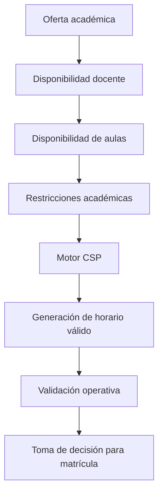

                                                                Análisis y validación del problema - SmartSched-UC

1. Propósito del documento

Este documento consolida el análisis y validación del problema para el sistema web **SmartSched-UC**, orientado a la generación óptima de horarios académicos mediante un enfoque formal de **Constraint Satisfaction Problem (CSP)** y optimización combinatoria. Su finalidad es evidenciar que el problema fue comprendido, modelado y validado de forma coherente con los requerimientos funcionales, no funcionales, actores, restricciones, dependencias, indicadores de éxito y finalidad de la GUI.

 2. Contexto del problema

La planificación académica universitaria es un proceso complejo porque combina múltiples variables interdependientes: cursos, docentes, aulas, turnos, disponibilidad, aforo, créditos, prerrequisitos y posibles cruces de horarios. Cuando este proceso se realiza manualmente o mediante sistemas rígidos, pueden generarse errores como horarios solapados, uso ineficiente de aulas, asignaciones incompatibles con docentes, sobrecarga de créditos y baja satisfacción estudiantil.

SmartSched-UC aborda este problema como un sistema de apoyo a la planificación académica y a la matrícula, permitiendo generar combinaciones válidas de horarios que respeten restricciones institucionales y criterios de optimización.
 3. Proceso mayor donde se aplica la optimización

El proceso mayor es la **planificación académica institucional y validación operativa de matrícula**.



La optimización contribuye a este proceso porque permite reducir conflictos antes de la matrícula, asignar aulas de acuerdo con capacidad y tipo, respetar disponibilidad docente y generar soluciones académicamente válidas. En lugar de revisar combinaciones manualmente, el sistema explora el espacio de soluciones y devuelve una alternativa compatible con las reglas definidas.

 4. Actores involucrados

| Actor | Necesidad principal | Interacción con el sistema |
|---|---|---|
| Estudiante | Obtener un horario sin cruces y dentro del rango de créditos. | Consulta cursos, genera proyección y valida matrícula simulada. |
| Coordinador académico | Garantizar coherencia de horarios y recursos. | Revisa restricciones, resultados y conflictos detectados. |
| Docente | Tener asignaciones compatibles con su disponibilidad. | Su disponibilidad alimenta el dominio del CSP. |

 5. Validación de requerimientos funcionales

| ID | Requerimiento funcional validado | Evidencia en el MVP | Criterio de aceptación |
|---|---|---|---|
| RF-01 | Generar horarios académicos automáticamente. | Endpoint `POST /api/schedules/generate` y servicio `scheduler.service.js`. | El sistema devuelve sesiones ordenadas por día y hora. |
| RF-02 | Evitar solapamientos de horarios. | Validación `overlaps()` y rechazo de cruces entre cursos. | No deben existir dos cursos simultáneos para el estudiante. |
| RF-03 | Validar disponibilidad docente. | Función `isTeacherAvailable()`. | Todo docente asignado debe estar disponible en la franja asignada. |
| RF-04 | Validar disponibilidad y capacidad de aula. | Función `canUseClassroom()` y validación de capacidad. | El aula debe cubrir aforo y tipo de curso. |
| RF-05 | Validar rango institucional de créditos. | Validación de créditos totales entre 20 y 25. | La carga académica debe quedar dentro del rango permitido. |
| RF-06 | Visualizar resultados en GUI. | Frontend React con tabla de asignaturas, bloques y resumen del horario. | El usuario debe poder revisar cursos, sesiones, aula, docente y métricas. |
| RF-07 | Exponer validación por API. | Endpoint `POST /api/schedules/validate`. | Un horario enviado debe devolver estado válido o lista de incidencias. |

6. Validación de requerimientos no funcionales

| ID | Requerimiento no funcional | Validación aplicada | Justificación |
|---|---|---|---|
| RNF-01 | Rendimiento | Métricas de tiempo, cobertura y balance. | El motor debe responder dentro de un tiempo aceptable para el MVP. |
| RNF-02 | Mantenibilidad | Separación en rutas, controladores, servicios, modelos y datos semilla. | Facilita pruebas, cambios y evolución del sistema. |
| RNF-03 | Modularidad | Motor CSP aislado en `scheduler.service.js`. | Permite mejorar el algoritmo sin romper la GUI. |
| RNF-04 | Trazabilidad | Documentos numerados, TOC y commits semánticos propuestos. | Permite relacionar requerimientos, código y evidencias. |
| RNF-05 | Usabilidad | GUI tipo portal académico con acciones claras. | Facilita interacción y validación visual del resultado. |
| RNF-06 | Testeabilidad | Pruebas Jest/Supertest para validaciones y API. | Evidencia práctica TDD. |

 7. Restricciones críticas del sistema

     7.1 Restricciones duras

Las restricciones duras son obligatorias. Si una se incumple, el horario no puede considerarse válido.

| Código | Restricción dura | Impacto en el sistema |
|---|---|---|
| HC-01 | No solapamiento entre cursos. | Evita que un estudiante tenga dos clases simultáneas. |
| HC-02 | Disponibilidad docente. | Impide asignar docentes fuera de su disponibilidad. |
| HC-03 | Capacidad de aula. | Evita asignar grupos a aulas insuficientes. |
| HC-04 | Tipo de aula compatible. | Diferencia laboratorio y aula teórica. |
| HC-05 | Horas requeridas por curso. | Cada curso debe recibir la carga horaria definida. |
| HC-06 | Créditos entre 20 y 25. | Cumple la regla institucional de carga académica. |

     7.2 Restricciones blandas

Las restricciones blandas mejoran la calidad de la solución, pero no invalidan necesariamente el horario.

| Código | Restricción blanda | Criterio de optimización |
|---|---|---|
| SC-01 | Minimizar tiempos muertos. | Penalización por huecos entre sesiones. |
| SC-02 | Balancear carga por día. | Distribuir sesiones de manera equilibrada. |
| SC-03 | Mejorar eficiencia de aula. | Reducir desperdicio de capacidad. |
| SC-04 | Generar resultados repetibles. | Mantener orden determinista para pruebas. |

 8. Dependencias del sistema

| Dependencia | Descripción | Riesgo asociado |
|---|---|---|
| Datos de cursos | Créditos, horas, tipo y matrícula estimada. | Datos incorrectos generan horarios inválidos. |
| Datos docentes | Disponibilidad y especialidad. | Disponibilidad incompleta reduce soluciones posibles. |
| Datos de aulas | Capacidad y tipo. | Aulas insuficientes generan cursos no programados. |
| Motor CSP | Backtracking y criterios de puntuación. | Puede crecer la complejidad combinatoria. |
| API Backend | Expone generación y validación. | Fallos afectan la GUI. |
| Frontend React | Visualiza resultados y métricas. | Mala UX dificulta validación operativa. |

 9. Posibles conflictos asociados a la asignación

| Conflicto | Ejemplo | Tratamiento en el sistema |
|---|---|---|
| Cruce de cursos | Dos cursos lunes 08:00-10:00. | Rechazo por `overlaps()`. |
| Cruce docente | Un docente asignado a dos cursos al mismo tiempo. | Incidencia `Conflicto docente`. |
| Cruce de aula | Dos cursos en la misma aula simultáneamente. | Incidencia `Conflicto aula`. |
| Aula insuficiente | 45 estudiantes en aula de 35. | Incidencia por capacidad. |
| Docente no disponible | Curso asignado fuera de disponibilidad. | Incidencia de disponibilidad. |
| Carga de créditos inválida | Menos de 20 o más de 25 créditos. | Incidencia de créditos fuera de rango. |

 10. Indicadores clave de éxito de la optimización

| Indicador | Fórmula / criterio | Meta para MVP | Interpretación |
|---|---|---|---|
| Tasa de conflictos | Conflictos detectados después de generar horario | 0 conflictos | Evalúa validez final. |
| Cobertura de asignación | Cursos asignados / cursos solicitados | ≥ 95% | Mide si el sistema programa toda la carga. |
| Tiempo de respuesta | Tiempo de generación del horario | < 5 segundos | Evalúa rendimiento percibido. |
| Utilización de recursos | Estudiantes asignados / capacidad total usada | ≥ 0.60 en escenarios reales | Evalúa eficiencia de aulas. |
| Balance diario | 1 / (1 + diferencia entre día más cargado y menos cargado) | ≥ 0.50 | Evalúa distribución de carga. |
| Cumplimiento de créditos | Créditos generados dentro de 20 a 25 | 100% | Valida regla académica. |
| Repetibilidad | Misma entrada produce misma salida | 100% | Favorece pruebas y auditoría. |

 11. Fundamentación CSP

El problema se modela como una tupla:

```text
CSP = (X, D, C)
```

Donde:

- **X:** conjunto de cursos que deben ser asignados.
- **D:** dominios formados por día, hora, aula y docente disponible.
- **C:** restricciones duras y blandas que determinan si una asignación es válida.

La búsqueda se realiza mediante backtracking con ordenamiento de cursos y puntuación de candidatos. El algoritmo evalúa combinaciones posibles y descarta aquellas que violan restricciones duras. Luego prioriza alternativas con menor desperdicio de aula, menor tiempo muerto y mejor balance.

 12. Decisiones técnicas justificadas

| Alternativa | Ventaja | Desventaja | Decisión |
|---|---|---|---|
| Validación manual | Fácil de explicar. | No escala y genera errores. | Descartada. |
| Fuerza bruta completa | Explora todo el espacio. | Alto costo computacional. | Descartada para MVP. |
| CSP con backtracking | Formal, entendible y verificable. | Puede crecer en escenarios grandes. | Seleccionada. |
| CSP + heurísticas | Reduce intentos y mejora calidad. | Mayor complejidad de implementación. | Usada progresivamente. |

 13. Finalidad de la GUI

La GUI no solo cumple una función visual. Su finalidad es permitir que el usuario valide operativamente el resultado generado por el motor CSP.

La interfaz facilita:

- selección y revisión de asignaturas;
- generación de proyección académica;
- visualización de bloques por curso;
- revisión de aula, docente, horario y cupos;
- consulta del resumen del horario final;
- visualización de métricas como cobertura, créditos, eficiencia y balance;
- simulación de envío de matrícula cuando el horario es válido.

Por ello, la GUI se relaciona directamente con los requerimientos funcionales y no funcionales: permite interacción, comprensión, validación, trazabilidad y toma de decisiones.

 14. Conclusión de validación

El análisis confirma que SmartSched-UC aborda un problema real de ingeniería de software con alta interdependencia de variables. La solución propuesta es coherente porque combina modelado formal CSP, arquitectura MERN, documentación SDD, pruebas TDD y una GUI orientada a validación operativa. Los indicadores definidos permiten evaluar la efectividad de la optimización de manera verificable y alineada con la planificación académica institucional.
