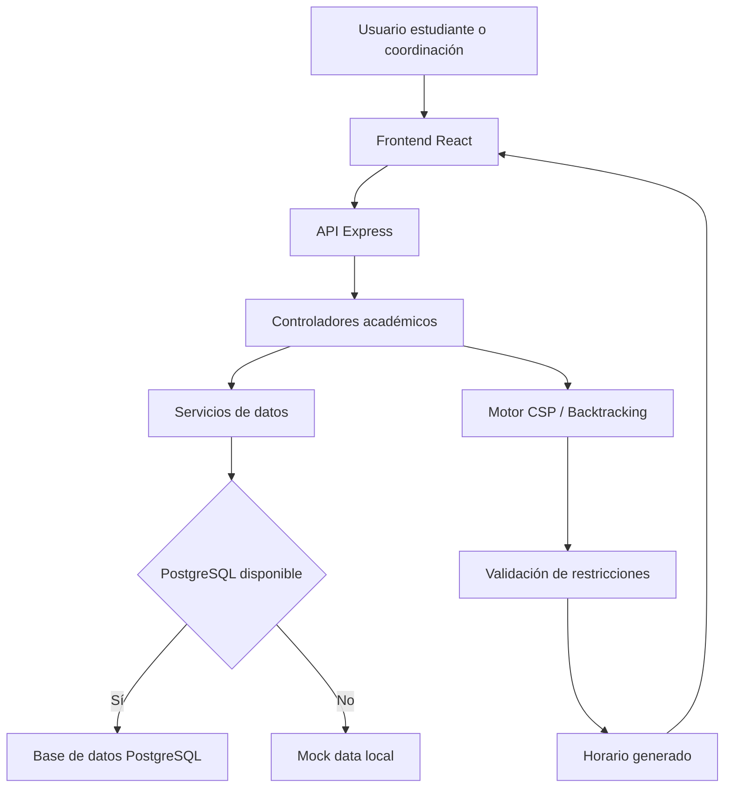
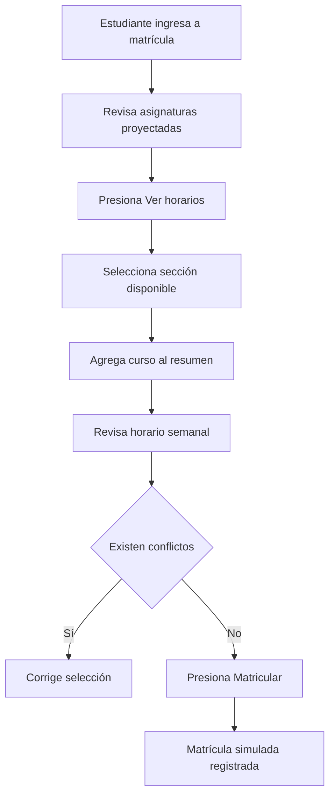

# ✅ Evidencias de validación, TDD y actualización del MVP - SmartSched-UC

## 1. Propósito del documento

Este documento tiene como finalidad registrar las evidencias técnicas de validación del MVP del proyecto **SmartSched-UC**, orientado a la generación óptima de horarios académicos universitarios mediante un enfoque basado en **Constraint Satisfaction Problem (CSP)**, reglas académicas, optimización combinatoria y desarrollo web.

La evidencia presentada permite demostrar que el proyecto no se limita a una propuesta teórica, sino que cuenta con una implementación funcional organizada, pruebas, endpoints, mejoras de interfaz, integración progresiva con PostgreSQL y validaciones relacionadas con el problema académico identificado.

El documento consolida:

* actualización del MVP;
* validación del backend;
* validación del frontend;
* aplicación de pruebas TDD;
* endpoints disponibles;
* integración con PostgreSQL;
* datos de prueba ampliados;
* evidencias de reglas académicas;
* mejoras de experiencia de usuario;
* trazabilidad con GitHub;
* criterios pendientes de validación final.

---

## 2. Alcance del MVP actualizado

El MVP de SmartSched-UC fue actualizado para representar de manera más realista el proceso de generación de horarios académicos. A diferencia de una maqueta visual simple, el sistema ahora integra reglas académicas, disponibilidad docente, capacidad de aulas, restricciones de infraestructura, carga académica, carga administrativa y validaciones orientadas al proceso de matrícula.

El alcance actual del MVP incluye:

| Componente               | Estado                      | Descripción                                                                                           |
| ------------------------ | --------------------------- | ----------------------------------------------------------------------------------------------------- |
| Backend Express          | Implementado                | API organizada para cursos, docentes, aulas, bloques horarios, restricciones y generación de horarios |
| Frontend React           | Implementado                | Interfaz académica para visualización, generación y revisión de horarios                              |
| Motor CSP / Backtracking | Implementado                | Genera combinaciones de horarios y valida restricciones                                               |
| Datos locales mock       | Implementado                | Se mantiene como respaldo si PostgreSQL no está disponible                                            |
| PostgreSQL               | En integración / validación | Base de datos relacional para datos académicos reales                                                 |
| Pruebas TDD              | Implementadas               | Pruebas unitarias para reglas principales del motor                                                   |
| Documentación            | Implementada                | Archivos técnicos en `docs/` y README                                                                 |
| GitHub                   | Implementado                | Control de versiones y trazabilidad de cambios                                                        |

---

## 3. Justificación técnica del MVP

El MVP fue diseñado para evidenciar el comportamiento central del sistema: generar horarios académicos válidos considerando restricciones interdependientes. La generación de horarios no es un problema lineal, ya que involucra múltiples entidades relacionadas: estudiantes, cursos, docentes, aulas, bloques horarios, créditos, carga académica, carga administrativa e infraestructura.

Por esta razón, el MVP debe demostrar que el sistema puede:

* recibir datos académicos;
* evaluar restricciones duras;
* considerar restricciones blandas;
* generar una propuesta de horario;
* detectar conflictos;
* mostrar métricas;
* presentar advertencias;
* emitir recomendaciones;
* permitir una futura matrícula simulada;
* almacenar o recuperar datos desde PostgreSQL.

---

## 4. Arquitectura funcional del MVP

La arquitectura actual del MVP se organiza en frontend, backend, motor de validación y capa de datos.



Esta arquitectura permite que el sistema continúe funcionando incluso si PostgreSQL no está disponible, gracias al uso de datos locales como mecanismo de respaldo. Esta decisión permite mantener continuidad de pruebas durante el desarrollo.

---

## 5. Componentes principales actualizados

Los principales componentes actualizados del proyecto son:

| Archivo o carpeta                               | Propósito                                                           |
| ----------------------------------------------- | ------------------------------------------------------------------- |
| `server/src/app.js`                             | Configuración principal del servidor Express                        |
| `server/src/config/db.js`                       | Configuración de conexión a PostgreSQL                              |
| `server/src/controllers/academic.controller.js` | Controladores para cursos, docentes, aulas, horarios y validaciones |
| `server/src/routes/academic.routes.js`          | Definición de endpoints académicos                                  |
| `server/src/data/academic.seed.js`              | Dataset local de respaldo                                           |
| `server/src/services/academic-data.service.js`  | Servicio de lectura de datos desde PostgreSQL o mock data           |
| `server/src/services/scheduler.service.js`      | Motor CSP, validaciones y generación de horarios                    |
| `server/src/database/schema.sql`                | Estructura de tablas PostgreSQL                                     |
| `server/src/database/seed.sql`                  | Datos iniciales para pruebas                                        |
| `server/src/database/indexes.sql`               | Índices para optimizar consultas                                    |
| `server/test/scheduler.test.js`                 | Pruebas del motor de horarios                                       |
| `client/src/App.js`                             | Interfaz principal del sistema                                      |
| `client/src/App.css`                            | Estilos de la interfaz                                              |
| `client/src/App.test.js`                        | Prueba base del frontend                                            |

---

## 6. Reglas académicas validadas

El sistema considera reglas académicas y operativas necesarias para que el horario generado sea válido y defendible.

| Código | Regla                                                       | Tipo   | Validación en el MVP                            |
| ------ | ----------------------------------------------------------- | ------ | ----------------------------------------------- |
| RD-01  | Un estudiante no puede tener dos cursos en el mismo horario | Dura   | Validación de solapamientos                     |
| RD-02  | Un docente no puede dictar dos cursos simultáneamente       | Dura   | Validación de conflicto docente                 |
| RD-03  | Un aula no puede usarse por dos cursos al mismo tiempo      | Dura   | Validación de conflicto de aula                 |
| RD-04  | El aula debe tener capacidad suficiente                     | Dura   | Comparación entre estudiantes estimados y aforo |
| RD-05  | Un curso de laboratorio debe asignarse a laboratorio        | Dura   | Validación de tipo de aula                      |
| RD-06  | El docente solo puede ser asignado en horarios disponibles  | Dura   | Validación de disponibilidad                    |
| RD-07  | Los bloques administrativos del docente deben respetarse    | Dura   | Bloqueo de horarios protegidos                  |
| RD-08  | El docente no debe superar carga máxima permitida           | Dura   | Validación de carga docente                     |
| RB-01  | Priorizar horarios compactos                                | Blanda | Recomendación de mejora                         |
| RB-02  | Compatibilidad con prácticas preprofesionales               | Blanda | Criterio de inclusión                           |
| RB-03  | Uso eficiente de infraestructura                            | Blanda | Evaluación de ocupación de aulas                |
| RB-04  | Balance de carga docente                                    | Blanda | Métricas de carga                               |

---

## 7. Consideraciones de carga docente

El MVP incorpora criterios relacionados con la realidad docente. No todos los docentes poseen la misma disponibilidad ni el mismo tipo de carga.

| Tipo de docente                  | Consideración aplicada                                            |
| -------------------------------- | ----------------------------------------------------------------- |
| Tiempo completo                  | Puede tener una carga referencial institucional de hasta 36 horas |
| Medio tiempo                     | Debe tener menor disponibilidad que un docente a tiempo completo  |
| Contratado                       | Tiene carga horaria reducida y disponibilidad limitada            |
| Docente con carga administrativa | Posee bloques protegidos por reuniones, coordinación o gestión    |
| Docente con baja carga académica | Puede priorizarse para balancear la asignación                    |
| Docente con alta carga académica | Debe evitarse la sobreasignación                                  |

La regla de 36 horas se interpreta como carga institucional referencial y no necesariamente como 36 horas de dictado directo. Puede incluir clases, asesorías, reuniones, coordinación, preparación académica y funciones administrativas.

---

## 8. Consideraciones de infraestructura

El MVP también valida el uso de aulas e infraestructura. Esto es importante porque no basta con que un aula esté libre; también debe ser adecuada para el curso y el número de estudiantes.

| Criterio                 | Regla                                               |
| ------------------------ | --------------------------------------------------- |
| Capacidad de aula        | La cantidad de estudiantes no debe superar el aforo |
| Ocupación ideal          | Entre 75% y 90% se considera uso adecuado           |
| Riesgo de sobreocupación | Más de 95% genera advertencia                       |
| Inválido                 | Más de 100% invalida la asignación                  |
| Subutilización           | Menos de 60% indica uso poco eficiente              |
| Tipo de aula             | Laboratorios deben asignarse a cursos prácticos     |
| Estado del aula          | Aulas en mantenimiento no deben asignarse           |

---

## 9. Integración con PostgreSQL

El sistema fue preparado para utilizar **PostgreSQL** como base de datos principal, debido a que el problema académico es altamente relacional.

La base contempla entidades como:

* cursos;
* docentes;
* aulas;
* bloques horarios;
* disponibilidad docente;
* bloques protegidos;
* restricciones;
* estudiantes;
* solicitudes de cursos;
* horarios generados;
* detalle de horarios.

La decisión de usar PostgreSQL se justifica porque permite:

| Característica         | Aporte al proyecto                                         |
| ---------------------- | ---------------------------------------------------------- |
| Integridad referencial | Relaciona correctamente cursos, docentes, aulas y horarios |
| Restricciones          | Permite validar reglas desde la base de datos              |
| Consultas SQL          | Facilita filtros, reportes y análisis                      |
| Índices                | Mejora rendimiento en consultas frecuentes                 |
| Transacciones          | Evita guardar horarios incompletos                         |
| Escalabilidad          | Permite aumentar alumnos, cursos y docentes                |

---

## 10. Tablas principales de PostgreSQL

Las tablas consideradas en la integración son:

| Tabla                      | Propósito                                                     |
| -------------------------- | ------------------------------------------------------------- |
| `courses`                  | Almacena cursos, créditos, tipo y horas requeridas            |
| `teachers`                 | Almacena docentes, contrato, carga académica y administrativa |
| `classrooms`               | Almacena aulas, capacidad, tipo y estado                      |
| `time_blocks`              | Almacena bloques horarios por día y hora                      |
| `course_teacher`           | Relaciona cursos con docentes                                 |
| `teacher_availability`     | Registra disponibilidad docente                               |
| `teacher_protected_blocks` | Registra bloques protegidos por carga administrativa          |
| `constraints`              | Almacena restricciones duras y blandas                        |
| `students`                 | Almacena alumnos de prueba                                    |
| `student_course_requests`  | Registra solicitudes de cursos por alumno                     |
| `schedules`                | Guarda horarios generados                                     |
| `schedule_items`           | Guarda detalle de cada horario generado                       |

---

## 11. Datos de prueba ampliados

Para validar el sistema con un escenario más realista, se amplió la base de datos de prueba.

| Entidad               | Cantidad esperada |
| --------------------- | ----------------: |
| Estudiantes           |                60 |
| Cursos                |                20 |
| Docentes              |                16 |
| Aulas                 |                14 |
| Bloques horarios      |                22 |
| Restricciones         |                12 |
| Solicitudes de cursos |        Más de 200 |

Esta ampliación permite evaluar el comportamiento del sistema con un volumen de datos mayor, más cercano a una situación académica real.

---

## 12. Evidencia SQL para conteo de datos

Para verificar los datos cargados en PostgreSQL, se puede ejecutar:

```sql
SELECT 'students' AS tabla, COUNT(*) AS total FROM students
UNION ALL
SELECT 'courses', COUNT(*) FROM courses
UNION ALL
SELECT 'teachers', COUNT(*) FROM teachers
UNION ALL
SELECT 'classrooms', COUNT(*) FROM classrooms
UNION ALL
SELECT 'time_blocks', COUNT(*) FROM time_blocks
UNION ALL
SELECT 'student_course_requests', COUNT(*) FROM student_course_requests
UNION ALL
SELECT 'constraints', COUNT(*) FROM constraints;
```

Resultado esperado:

| Tabla       | Total esperado |
| ----------- | -------------: |
| students    |             60 |
| courses     |             20 |
| teachers    |             16 |
| classrooms  |             14 |
| time_blocks |             22 |
| constraints |             12 |

---

## 13. Endpoints principales del backend

Los endpoints principales del MVP son:

| Método | Endpoint                  | Descripción                                 |
| ------ | ------------------------- | ------------------------------------------- |
| GET    | `/api/health`             | Verifica estado del sistema y base de datos |
| GET    | `/api/courses`            | Lista cursos disponibles                    |
| GET    | `/api/teachers`           | Lista docentes                              |
| GET    | `/api/classrooms`         | Lista aulas                                 |
| GET    | `/api/time-blocks`        | Lista bloques horarios                      |
| GET    | `/api/constraints`        | Lista restricciones                         |
| POST   | `/api/schedules/generate` | Genera horario académico                    |
| POST   | `/api/schedules/validate` | Valida horario enviado                      |
| GET    | `/api/debug/schema`       | Revisa tablas y columnas detectadas         |

---

## 14. Evidencia esperada del endpoint de salud

Para validar si el sistema está usando PostgreSQL, se debe abrir:

```text
http://localhost:5000/api/health
```

Respuesta esperada cuando PostgreSQL funciona:

```json
{
  "status": "ok",
  "database": "postgresql",
  "postgresEnabled": true,
  "usingFallback": false
}
```

Respuesta esperada cuando usa mock data:

```json
{
  "status": "ok",
  "database": "mock-data",
  "postgresEnabled": false,
  "usingFallback": true
}
```

La respuesta correcta para evidenciar conexión real debe indicar:

```text
database: postgresql
usingFallback: false
```

---

## 15. Evidencia de fallback a mock data

El sistema mantiene un mecanismo de respaldo mediante mock data local. Esto permite que la aplicación continúe funcionando aunque PostgreSQL no esté disponible.

Este mecanismo es útil durante desarrollo porque:

* evita que la app se caiga completamente;
* permite probar frontend sin base de datos;
* facilita desarrollo local;
* mejora resiliencia del MVP.

Sin embargo, para la entrega final se debe evidenciar que PostgreSQL está funcionando correctamente y que el fallback no se activa innecesariamente.

---

## 16. Validación del backend

Para validar el backend, se ejecutan los siguientes comandos desde:

```text
smartsched-uc/server
```

Instalación de dependencias:

```bash
npm install
```

Prueba de conexión a base de datos:

```bash
npm run db:test
```

Inspección de esquema PostgreSQL:

```bash
npm run db:inspect
```

Ejecución de pruebas:

```bash
npm test
```

Inicio del servidor:

```bash
npm start
```

Resultado esperado:

```text
PostgreSQL conectado correctamente
Servidor SmartSched-UC en http://localhost:5000
```

---

## 17. Validación del frontend

Para validar el frontend, se ejecutan los siguientes comandos desde:

```text
smartsched-uc/client
```

Instalación de dependencias:

```bash
npm install
```

Ejecución de pruebas:

```bash
npm test -- --watchAll=false
```

Compilación:

```bash
npm run build
```

Inicio del cliente:

```bash
npm start
```

Resultado esperado:

```text
Compiled successfully
Local: http://localhost:3000
```

---

## 18. Pruebas TDD del motor de horarios

Las pruebas TDD permiten validar que las reglas principales del sistema funcionen correctamente antes de considerar estable el MVP.

Casos de prueba considerados:

| Código | Caso de prueba                     | Resultado esperado                                |
| ------ | ---------------------------------- | ------------------------------------------------- |
| TDD-01 | Generar horario con cursos válidos | El sistema devuelve horario válido                |
| TDD-02 | Detectar cruce de horario          | El sistema marca conflicto                        |
| TDD-03 | Detectar conflicto docente         | El sistema evita asignación simultánea            |
| TDD-04 | Detectar conflicto de aula         | El sistema evita uso simultáneo del aula          |
| TDD-05 | Validar capacidad de aula          | El sistema advierte o rechaza sobreocupación      |
| TDD-06 | Validar carga docente              | El sistema evita sobreasignación                  |
| TDD-07 | Respetar bloques administrativos   | El sistema no asigna clases en bloques protegidos |
| TDD-08 | Generar métricas                   | El sistema devuelve métricas de horario           |

---

## 19. Resultado de pruebas registrado

Evidencia esperada del backend:

```text
Backend verificado con npm test en server: pruebas OK.
```

Evidencia esperada del frontend:

```text
Frontend verificado con npm test -- --watchAll=false en client: pruebas OK.
```

Evidencia esperada del build:

```text
Build del cliente verificado con npm run build en client: compilación OK.
```

Si alguna prueba falla, se debe registrar el error, corregirlo y volver a ejecutar.

---

## 20. Validación de generación de horario

Para validar la generación de horarios se utiliza:

```text
POST /api/schedules/generate
```

El resultado esperado debe incluir:

| Campo                 | Descripción                    |
| --------------------- | ------------------------------ |
| `summary`             | Resumen del horario generado   |
| `validation`          | Estado de validez y conflictos |
| `metrics`             | Métricas de generación         |
| `teacherLoad`         | Carga docente                  |
| `infrastructureUsage` | Uso de aulas                   |
| `warnings`            | Advertencias                   |
| `recommendations`     | Recomendaciones                |
| `items`               | Cursos asignados en el horario |

Ejemplo de salida esperada:

```json
{
  "summary": {
    "assignedCourses": 5,
    "totalCredits": 20
  },
  "validation": {
    "valid": true,
    "issues": []
  },
  "metrics": {
    "conflicts": 0,
    "assignmentCoverage": 1
  }
}
```

---

## 21. Validación de interfaz de usuario

La interfaz fue revisada para mejorar su usabilidad. El objetivo es que no parezca únicamente un tablero técnico, sino una vista de matrícula más compacta y cercana a un sistema universitario real.

La mejora propuesta considera:

| Vista        | Propósito                                |
| ------------ | ---------------------------------------- |
| Proyecciones | Mostrar asignaturas disponibles          |
| Ver horarios | Permitir revisar horarios por asignatura |
| Horario      | Mostrar grilla semanal                   |
| Resumen      | Mostrar cursos agregados y créditos      |
| Coordinación | Mostrar información técnica del sistema  |

Esta organización permite separar la experiencia del estudiante de la información técnica de coordinación académica.

---

## 22. Flujo de matrícula simulado

El flujo ideal del MVP es:



Este flujo busca reducir la complejidad visual y facilitar que el estudiante sepa qué hacer sin una explicación previa extensa.

---

## 23. Evidencias de experiencia de usuario

Aspectos evaluados en la interfaz:

| Criterio                | Evaluación                                               |
| ----------------------- | -------------------------------------------------------- |
| Claridad de asignaturas | El estudiante puede identificar cursos disponibles       |
| Acción visible          | El botón “Ver horarios” permite revisar opciones         |
| Resumen de matrícula    | El usuario puede revisar cursos agregados                |
| Créditos acumulados     | El sistema muestra créditos seleccionados                |
| Horario semanal         | El estudiante puede visualizar distribución por día      |
| Conflictos              | El sistema muestra observaciones de forma clara          |
| Coordinación separada   | La información técnica no satura la vista del estudiante |

---

## 24. Evidencia de datos reales vs mock data

Para confirmar si el sistema usa PostgreSQL o mock data se debe revisar:

```text
http://localhost:5000/api/health
```

También se puede revisar la consola del backend.

Uso correcto de PostgreSQL:

```text
PostgreSQL conectado correctamente
Servidor SmartSched-UC en http://localhost:5000
```

Alerta de uso de mock data:

```text
Fallo la lectura desde PostgreSQL, usando mock data local
```

Si aparece la alerta anterior, significa que la base está conectada, pero alguna consulta SQL no coincide con la estructura real. En ese caso se debe revisar la capa `academic-data.service.js`, los alias de columnas y las consultas con JOIN.

---

## 25. Validación del esquema PostgreSQL

Para revisar columnas y tablas existentes, se puede ejecutar:

```sql
SELECT 
    table_name,
    column_name,
    data_type
FROM information_schema.columns
WHERE table_schema = 'public'
ORDER BY table_name, ordinal_position;
```

Para revisar columnas específicas:

```sql
SELECT 
    table_name,
    column_name
FROM information_schema.columns
WHERE table_schema = 'public'
AND column_name IN ('day', 'duration_hours', 'start_time', 'end_time', 'code', 'type')
ORDER BY table_name, column_name;
```

Esta evidencia permite confirmar si el backend y la base de datos están alineados.

---

## 26. Validación de rendimiento y sostenibilidad

El MVP también considera criterios de eficiencia y sostenibilidad del software. Las mejoras aplicadas o propuestas incluyen:

| Mejora                           | Beneficio                                        |
| -------------------------------- | ------------------------------------------------ |
| Paginación                       | Reduce cantidad de datos enviados                |
| PostgreSQL con índices           | Mejora tiempos de consulta                       |
| Consultas con campos específicos | Evita transferir datos innecesarios              |
| Fallback controlado              | Evita caída completa del sistema                 |
| Separación backend/frontend      | Mejora mantenibilidad                            |
| Interfaz compacta                | Reduce tiempo de uso del estudiante              |
| Uso de datos reales de prueba    | Permite validar comportamiento con mayor volumen |

---

## 27. Evidencias requeridas para la entrega

Para fortalecer la entrega, se recomienda adjuntar capturas de:

| Evidencia  | Descripción                                                     |
| ---------- | --------------------------------------------------------------- |
| Captura 1  | `npm test` backend ejecutado correctamente                      |
| Captura 2  | `npm test -- --watchAll=false` frontend ejecutado correctamente |
| Captura 3  | `npm run build` frontend exitoso                                |
| Captura 4  | `/api/health` mostrando PostgreSQL                              |
| Captura 5  | `/api/courses` mostrando datos de PostgreSQL                    |
| Captura 6  | `/api/teachers` mostrando docentes                              |
| Captura 7  | `/api/classrooms` mostrando aulas                               |
| Captura 8  | pgAdmin mostrando 60 alumnos                                    |
| Captura 9  | Interfaz de matrícula compacta                                  |
| Captura 10 | GitHub con commits recientes                                    |

---

## 28. Trazabilidad con GitHub

Los cambios deben registrarse con commits descriptivos para evidenciar control de versiones.

Commits sugeridos:

```bash
git add docs/21_evidencias_validacion_tdd_mvp.md
git commit -m "docs: improve MVP validation and TDD evidence"

git add smartsched-uc/server
git commit -m "feat: align backend with PostgreSQL academic data"

git add smartsched-uc/client
git commit -m "feat: improve enrollment interface usability"

git add docs README.md
git commit -m "docs: update evidence and repository documentation"

git push origin main
```

---

## 29. Checklist de cumplimiento

| Criterio                                | Estado                        |
| --------------------------------------- | ----------------------------- |
| Requerimientos funcionales validados    | Cumplido                      |
| Requerimientos no funcionales validados | Cumplido                      |
| Restricciones académicas identificadas  | Cumplido                      |
| Actores y necesidades considerados      | Cumplido                      |
| MVP actualizado                         | Cumplido                      |
| Backend organizado                      | Cumplido                      |
| Frontend actualizado                    | Cumplido                      |
| TDD aplicado                            | Cumplido                      |
| PostgreSQL integrado                    | En validación final           |
| Datos ampliados a 60 alumnos            | Cumplido                      |
| Documentación actualizada               | Cumplido                      |
| GitHub con commits descriptivos         | Pendiente de push final       |
| Evidencias capturadas                   | Pendiente de capturas finales |

---

## 30. Pendientes técnicos

Aunque el MVP ya cuenta con avances importantes, se identifican pendientes para una versión más completa:

| Pendiente             | Descripción                                                                      |
| --------------------- | -------------------------------------------------------------------------------- |
| CRUD completo         | Crear, editar y eliminar cursos, docentes, aulas y estudiantes desde la interfaz |
| Autenticación         | Diferenciar estudiante, coordinador y administrador                              |
| Matrícula real        | Guardar matrícula final por estudiante                                           |
| Reportes              | Exportar horarios y métricas                                                     |
| Validación avanzada   | Considerar prerrequisitos y cupos por sección                                    |
| Optimización avanzada | Mejorar eficiencia del motor CSP para grandes volúmenes                          |
| Auditoría             | Registrar cambios administrativos                                                |
| Despliegue            | Publicar el sistema en entorno cloud o servidor institucional                    |

---

## 31. Conclusión

La actualización del MVP de SmartSched-UC demuestra un avance significativo en análisis, implementación y validación técnica. El sistema ya no se limita a mostrar una propuesta visual, sino que incorpora reglas académicas, validaciones de horarios, control de docentes, aulas, infraestructura y conexión progresiva con PostgreSQL.

La aplicación mantiene una arquitectura ordenada, permite trabajar con datos locales como respaldo, integra una base de datos relacional para escenarios reales, considera pruebas TDD y mejora la experiencia del usuario mediante una interfaz orientada a matrícula.

Con estas evidencias, el proyecto demuestra coherencia entre problema, requerimientos, arquitectura, implementación, pruebas, documentación y repositorio. Además, queda preparado para continuar con funcionalidades más avanzadas como CRUD completo, matrícula real, reportes, autenticación y despliegue.
